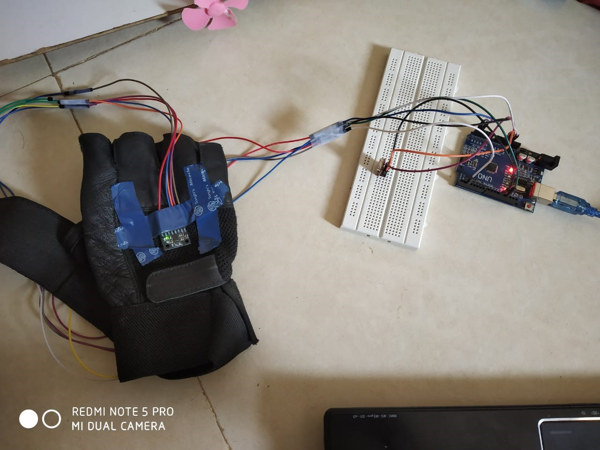
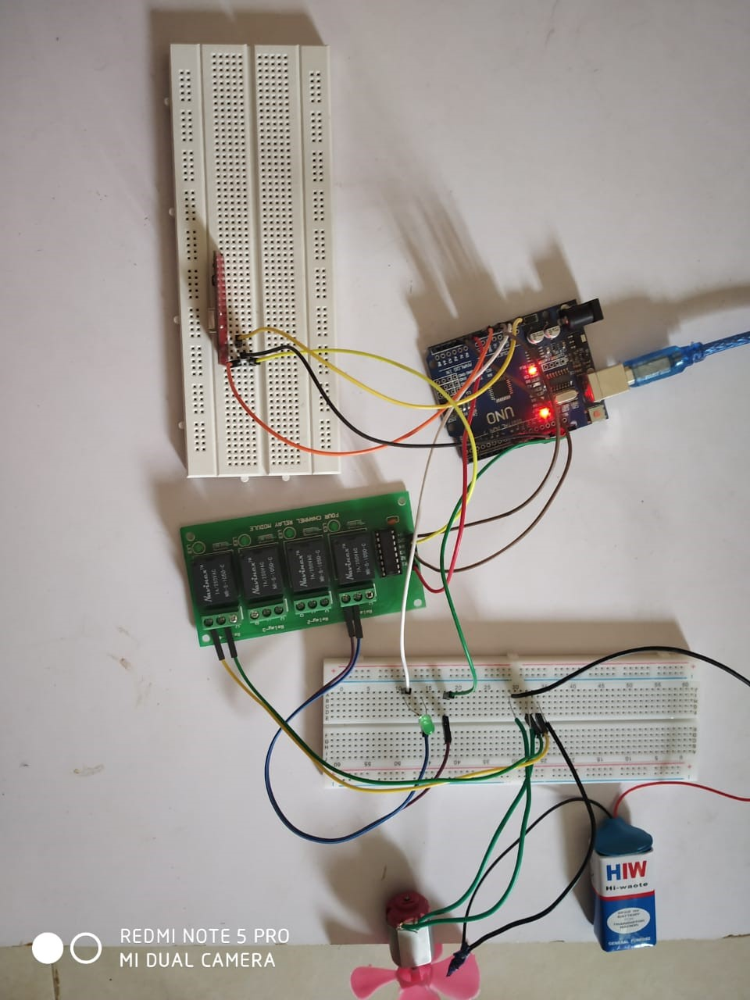

### HomeAutomation_GestureBased
This is a mini-project, which is low cost application of gesture based home automation.

## ABSTRACT:  
Rehabilitation engineering is the application of engineering sciences and technology to improve the quality of life for the people with disabilities. A device is designed for the visually challenged people to aid them in operating the home appliances individually. A Microelectromechanical Systems (MEMS) accelerometer is used to sense the accelerations of a hand in motion in three perpendicular directions that is (x, y, z) and transmitted to wireless protocol using Radio Frequency (RF). The RF signals transmission frequency is 2.25 GHz. The gesture code templates are already stored in the microcontroller at the receiver section. The received gestures and the hand gesture shown by the visually challenged is recognized and compared with the templates stored in the receiver. If the templates match the stored templates, then accordingly the home appliances are controlled

## PROPOSED SCHEME:
A MPU accelerometer based home automation system is designed for visually challenged and partially paralyzed persons. The system comprises accelerometer, microcontroller, RF transmitter and receiver and the communication is through RF signals. The accelerometer senses the hand gestures and signals are transmitted to receiver section through RF transmitter. RF receiver receives the transmitted signal compares with the already stored gestures, only when the similar hand -gestures are identified, then the home appliances are controlled.

## COMPONENTS REQUIRED:
1.	MPU-6050  Accelerometer
2.	Arduino UNO
3.	RF Transmitter
4.	RF Receiver
5.	Relay
6.	LED Bulb
7.	Fan

## Transmitter Module:

## Reciever Module:

